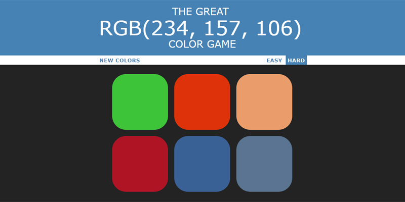
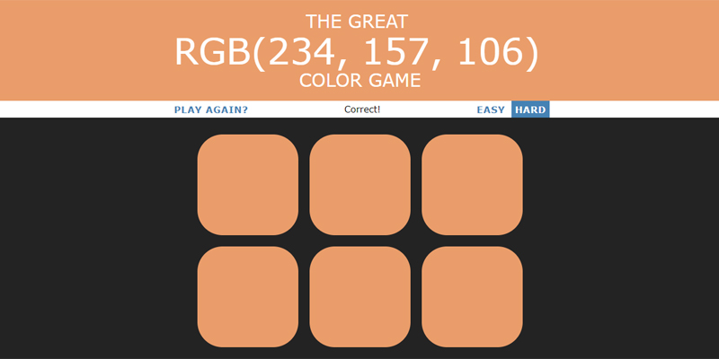

RGB color matching application built with HTML, CSS, and Javascript.

Two modes: Easy (3 choices), Hard (6 choices)

When the correct color is chosen, the h1 and remaining squares transition to that color.

